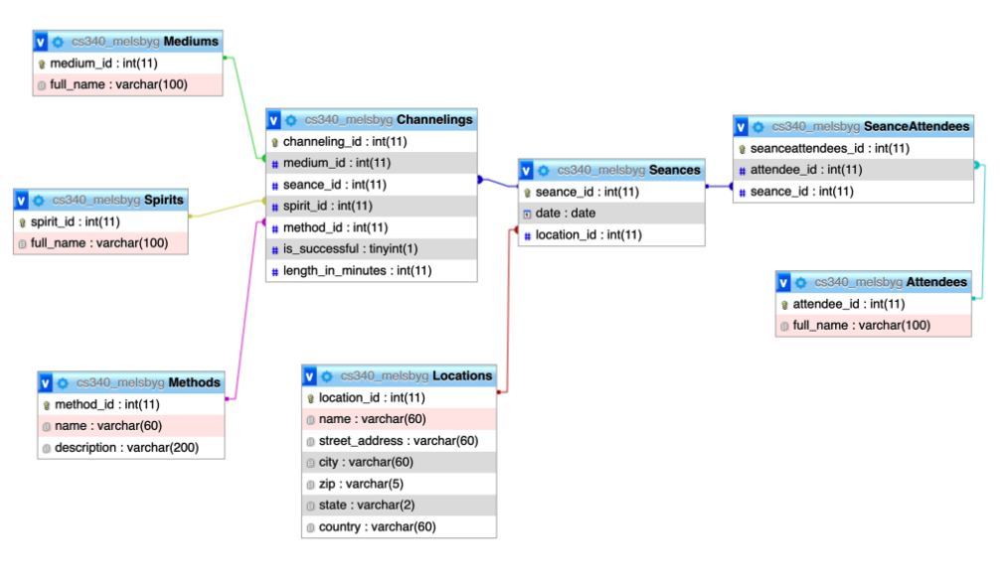
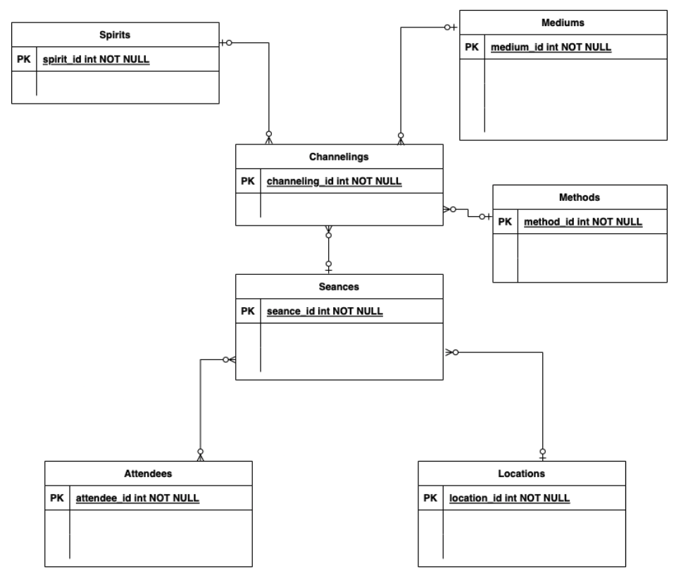
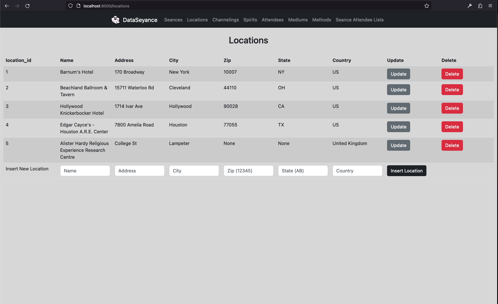
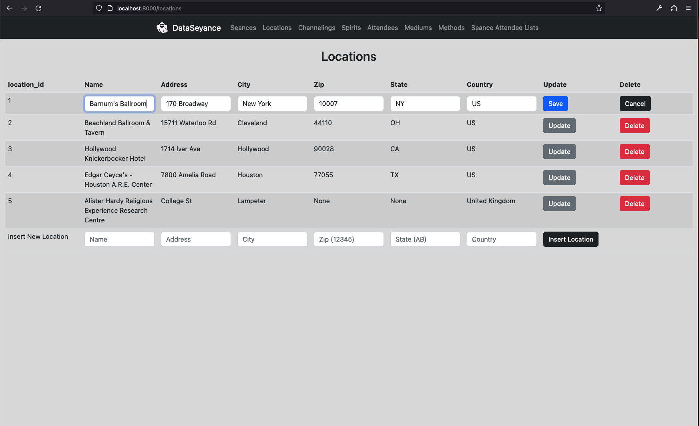

# DataSeyance
A Flask webapp that allows users to perform CRUD operations on a MariaDB database.

## Features
Displays editable tables from a relational database of Seance data. \
CRUD operations can be performed on tables.

### Schema

### ERD


### In-line Editing
The Locations table initially looks like this:

When a user clicks the Update button, the page is rerendered as such:

Once the Save button is clicked, the row in the database updates.


For more information, read our [Documentation and Presentation PDF](documentation_and_presentation.pdf)

## Setup
### MariaDB
First, setup a MariaDB database on your system or anywhere you can access. Then create a database, enter the MariaDB CLI, and run `source [relative path to DDL.sql]`. This should populate the database with the necessary tables and rows.

### Running with venv
I wouldn't recommend doing this--it some of our dependencies are very particular about Python version (needs to be 3.6, at least from the error I get when I try and run it on my machine), and you need certain MariaDB libraries installed. However, if you want to:
- Navigate in the terminal to the project root.
- Run `python -m venv .venv`
- Activate the virtual environment by running `source .venv/bin/activate`
- Install necessary packages with `pip install -r requirements.txt`
- Cross fingers and hope the installation process doesn't terminate with an error.
- Create a .env file in project root. The content of the file should be of the form
```
340DBHOST=[host name or ip of mariadb]
340DBUSER=[user name for mariadb]
340DBPW=[password for above user]
340DB=[name of mariadb database]
```
- Run app by running `flask run` at project root.

### Running with Docker
- Navigate in the terminal to the project root.
- Create a .env file in project root. The content of the file should be of the form
```
340DBHOST=[host name or ip of mariadb]
340DBUSER=[user name for mariadb]
340DBPW=[password for above user]
340DB=[name of mariadb database]
```
- Run the command `docker build . -t dataseyance`
- Then run `docker run -p 5000:5000 dataseyance`
- The app should be accesible from `http://localhost:5000`
- Port can be changed by modifying the command to `docker run -p [desired port]:5000 dataseyance`

